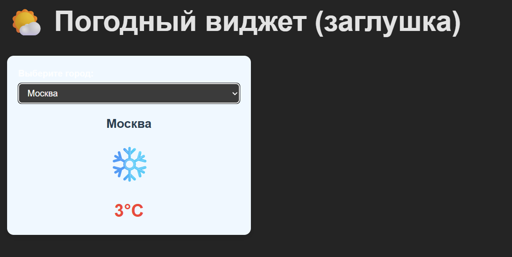
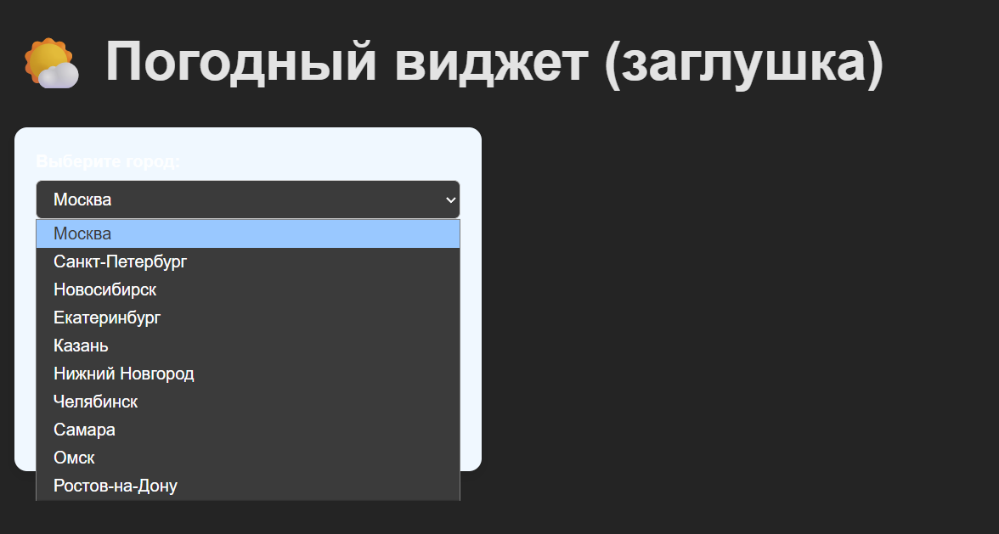

# Погодный виджет (заглушка)

Простой React-виджет, имитирующий отображение погоды. Не использует реальный API — все данные генерируются локально.

## 📸 Скриншоты




## 🔧 Функционал

- Выбор города из списка
- Отображение фиктивной температуры (от -10°C до +30°C)
- Иконка погоды (случайная, но стабильная для каждого города)
- Чистый и адаптивный интерфейс

## ▶️ Запуск

```bash
npm install
npm run dev